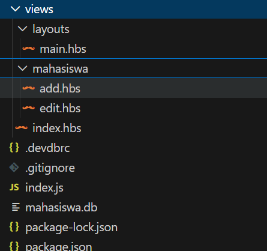

# Tutorial Membuat Aplikasi Data Mahasiswa Sederhana

## Apa yang Akan  Dipelajari?

Di tutorial ini, kita akan membuat **aplikasi web sederhana** untuk menyimpan dan mengelola data mahasiswa dengan fitur:

- Melihat daftar mahasiswa
- Menambah data mahasiswa baru
- Mengubah data yang sudah ada
- Menghapus data

## Teknologi yang Digunakan

| Nama | Fungsi |
|------|--------|
| **Node.js** | Server untuk menjalankan program |
| **Express** | Framework untuk membuat website |
| **SQLite** | Database untuk menyimpan data |
| **Handlebars** | Template untuk tampilan halaman |
| **Bootstrap** | Library untuk membuat tampilan bagus |

## Struktur Folder Nantinya

## Halaman Selanjutnya

→ [02 - Setup dan Proses Membuat Program](/02-setup_dan_buat_program.md)
